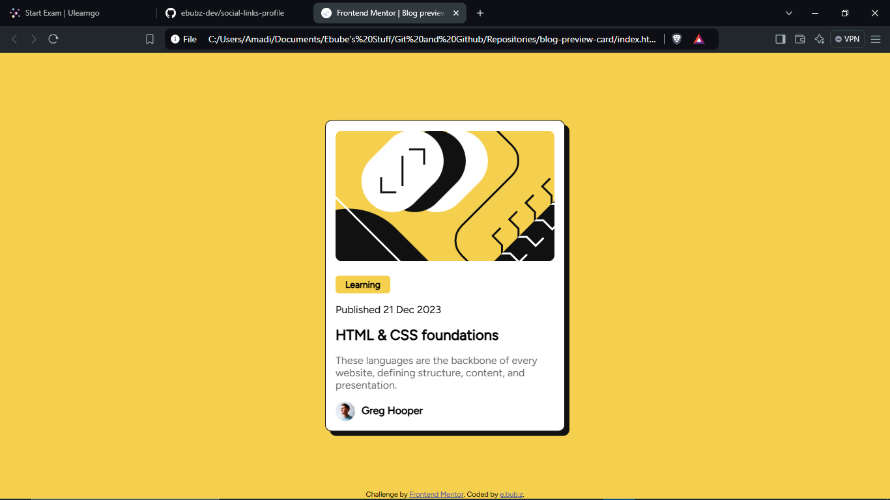
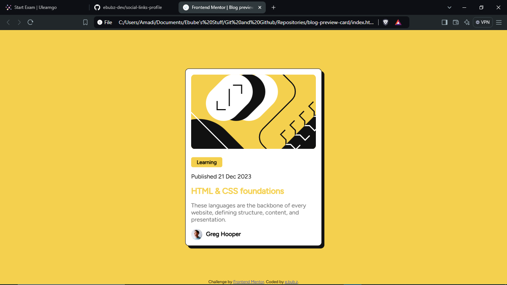

# Frontend Mentor - Blog preview card solution

This is a solution to the [Blog preview card challenge on Frontend Mentor](https://www.frontendmentor.io/challenges/blog-preview-card-ckPaj01IcS). Frontend Mentor challenges help you improve your coding skills by building realistic projects. 

## Table of contents

  - [The challenge](#the-challenge)
  - [Screenshot](#screenshot)
  - [Links](#links)
  - [Built with](#built-with)
- [Author](#author)

### The challenge

Users should be able to:

- See hover and focus states for all interactive elements on the page

### Screenshot

### Links

- Solution URL: [https://github.com/ebubz-dev/blog-preview-card](https://github.com/ebubz-dev/blog-preview-card)
- Live Site URL: [https://ebubz-dev.github.io/blog-preview-card/](https://ebubz-dev.github.io/blog-preview-card/)

### Built with

- Semantic HTML5 markup
- CSS custom properties

## Author

- Website - [Ebube](https://ebubz-dev.github.io)
- Frontend Mentor - [@ebubz-dev](https://www.frontendmentor.io/profile/ebubz-dev)
